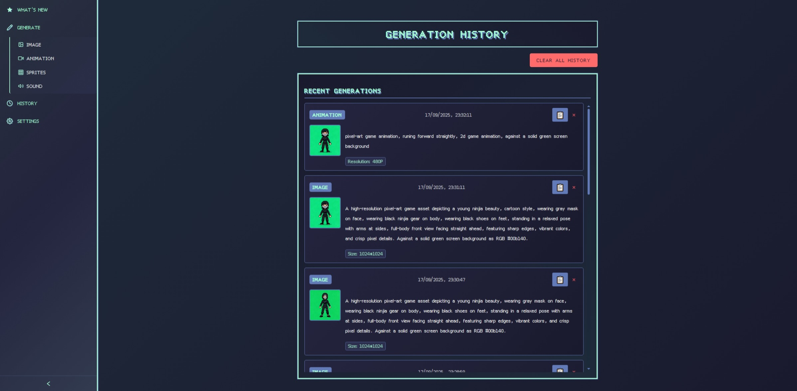
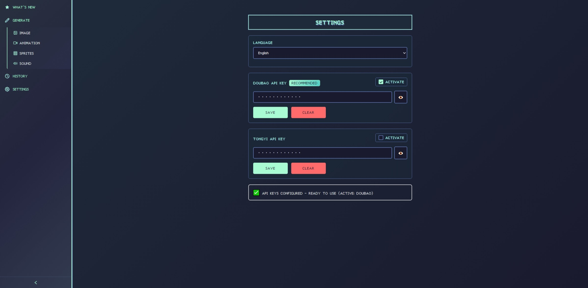

<div align="center">
  
  <h1 style="margin: 0; font-size: 30px;">PiXelDa</h1>
</div>

PiXelDa is an AI-powered platform designed for generating pixel-art game assets, including images and animations, using a FastAPI backend and Angular frontend. It leverages advanced AI models from <a href="https://bailian.console.aliyun.com/?tab=api#/api/?type=model&url=2712195">Tongyi</a> and <a href="https://www.volcengine.com/docs/82379/1541594">Doubao</a> to create custom content for 2D pixel-art games.

<p align="center">
  <a href="https://opensource.org/licenses/MIT"></a>
  <a href="https://www.python.org/"></a>
  <a href="https://nodejs.org/"></a>
  <a href="https://angular.io/"></a>
</p>

## 📋 Table of Contents

- [Features](#features)
- [Architecture](#architecture)
- [Prerequisites](#prerequisites)
- [Installation](#installation)
- [Dependencies](#dependencies)
- [Contributing](#contributing)
- [License](#license)

<br>

## ✨ Features

- ### 🎨 Game Assets Generation

  #### Specialized tools for creating images and animations tailored for game development.

- ### 🖼️ Image Generation

  #### Generate images using AI models with custom prompts.

  

  #### Sample Prompts

  A high-resolution pixel-art game asset depicting a young ninjia beauty, cartoon style, wearing no mask on face, wearing black ninjia gear on body, wearing black shoes on feet, standing in a relaxed pose with arms at sides, full-body front view facing straight ahead, featuring sharp edges, vibrant colors, and crisp pixel details. Against a solid green screen background as RGB #00b140.

- ### 🎬 Animation Generation

  #### Create videos from first frame image and prompts.

  

- ### ✂️ Frame Splitting

  #### Extract and preview frames from animation for 2D sprites.

  

  

- ### 🧹 Background Removal (beta)

  #### Remove backgrounds from frames using rembg.

- ### 💾 Caching and History

  #### Efficient caching of generated images and animations.

  

- ### ⚙️ Settings

  #### Switch languages and AI models

  

<br>

## 🏗️ Architecture

- **Backend**: Built with FastAPI, Python. Handles API requests, AI model interactions, and file processing.
- **Frontend**: Angular application for user interaction.
- **Cache**: Stores generated animation, images, frames, and processed data.
- **Logs**: Server logs.

<br>

## 📋 Prerequisites

- Python 3.13
- Node.js 22
- Angular 20

<br>

## 🚀 Installation

### Backend Setup

1. Navigate to the server directory:

   ```bash
   cd projects/server
   ```

2. Install Python dependencies:

   ```bash
   pip install -r requirements.txt
   ```

3. Run the server:
   ```bash
   python app.py
   ```
   The server will start on `http://0.0.0.0:8000` by default.

### Frontend Setup

1. Navigate to the UI directory:

   ```bash
   cd projects/ui
   ```

2. Install Node.js dependencies:

   ```bash
   npm install
   ```

3. Start the development server:
   ```bash
   npm start
   ```
   The UI will be available at `http://localhost:4200`.

<br>

## 📦 Dependencies

### Backend

| Package                | Version   |
| ---------------------- | --------- |
| FastAPI                | 0.116.1   |
| Uvicorn                | 0.35.0    |
| DashScope SDK (Tongyi) | 1.24.4    |
| Volcano SDK (Doubao)   | 0.1.0     |
| OpenCV                 | 4.12.0.88 |
| rembg                  | 2.0.67    |
| Pillow                 | 11.3.0    |

### Frontend

| Package | Version |
| ------- | ------- |
| Angular | 20      |
| RxJS    | Latest  |

<br>

## 📄 License

This project is licensed under the MIT License - see the [LICENSE](LICENSE) file for details.
