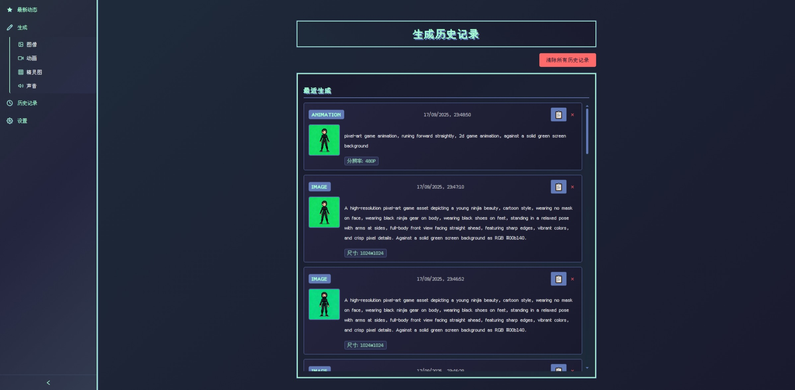
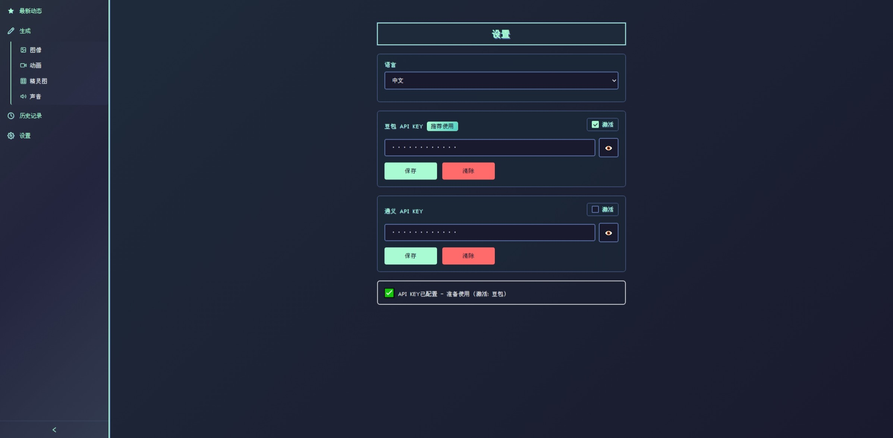

<div align="center">
  
  <h1 style="margin: 0; font-size: 30px;">PiXelDa</h1>
</div>

PiXelDa 是一个基于 AI 的平台，专为生成像素艺术游戏开发资源而设计，包括图像和动画，使用 FastAPI 后端和 Angular 前端。它利用来自 <a href="https://bailian.console.aliyun.com/?tab=api#/api/?type=model&url=2712195">Tongyi</a> 和 <a href="https://www.volcengine.com/docs/82379/1541594">Doubao</a> 的先进 AI 模型为 2D 像素艺术游戏创建自定义内容。

<p align="center">
  <a href="https://opensource.org/licenses/MIT"></a>
  <a href="https://www.python.org/"></a>
  <a href="https://nodejs.org/"></a>
  <a href="https://angular.io/"></a>
</p>

## 📋 目录

- [功能](#功能)
- [架构](#架构)
- [环境依赖](#环境依赖)
- [安装](#安装)
- [依赖项](#依赖项)
- [贡献](#贡献)
- [许可证](#许可证)

<br>

## ✨ 功能

- ### 🎨 游戏资产生成

  #### 专为游戏开发创建图像和动画的专业工具。

- ### 🖼️ 图像生成

  #### 使用 AI 模型和自定义提示生成图像。

  

  #### 示例提示

  一张高精度像素风格图片，图中有一个年轻美女忍者，卡通风格, 不戴面罩, 身穿黑色忍者服, 脚穿黑色鞋子, 站立姿势，双手放松下垂, 全身照，向前看, 边缘清晰, 色彩艳丽，像素细节清晰， 绿幕背景。

- ### 🎬 动画生成

  #### 从首帧图像和提示创建视频。

  

- ### ✂️ 帧分割

  #### 从动画中提取并预览帧，用于 2D 精灵图。

  

  

- ### 🧹 背景移除 (beta)

  #### 使用 rembg 从帧中移除背景。

- ### 💾 缓存和历史

  #### 高效缓存生成的图像和动画。

  

- ### ⚙️ 设置

  #### 切换语言和 AI 模型

  

<br>

## 🏗️ 架构

- **后端**：使用 FastAPI、Python 构建。处理 API 请求、AI 模型交互和文件处理。
- **前端**：用于用户交互的 Angular 应用程序。
- **缓存**：存储生成的动画、图像、帧和处理数据。
- **日志**：服务器日志。

<br>

## 📋 环境依赖

- Python 3.13
- Node.js 22
- Angular 20

<br>

## 🚀 安装

### 后端设置

1. 导航到服务器目录：

   ```bash
   cd projects/server
   ```

2. 安装 Python 依赖项：

   ```bash
   pip install -r requirements.txt
   ```

3. 运行服务器：
   ```bash
   python app.py
   ```
   服务器将在默认情况下在 `http://0.0.0.0:8000` 上启动。

### 前端设置

1. 导航到 UI 目录：

   ```bash
   cd projects/ui
   ```

2. 安装 Node.js 依赖项：

   ```bash
   npm install
   ```

3. 启动开发服务器：
   ```bash
   npm start
   ```
   UI 将在 `http://localhost:4200` 上可用。

<br>

## 📦 依赖项

### 后端

| 包名                   | 版本      |
| ---------------------- | --------- |
| FastAPI                | 0.116.1   |
| Uvicorn                | 0.35.0    |
| DashScope SDK (Tongyi) | 1.24.4    |
| Volcano SDK (Doubao)   | 0.1.0     |
| OpenCV                 | 4.12.0.88 |
| rembg                  | 2.0.67    |
| Pillow                 | 11.3.0    |

### 前端

| 包名    | 版本 |
| ------- | ---- |
| Angular | 20   |
| RxJS    | 最新 |

<br>

## 📄 许可证

此项目根据 MIT 许可证授权 - 有关详细信息，请参阅 [LICENSE](LICENSE) 文件。
